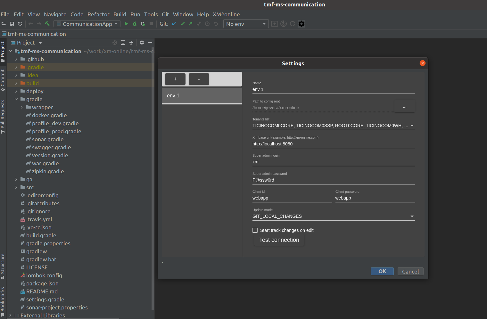

# Introduction
This guide helps to setup minimal required environment for XM developers

# Table of contents

 * [Setup local environment](#setup-local-environment)
 * [xm-ms-config](#xm-ms-config)
 * [xm-gate](#xm-gate)
 * [xm-uaa](#xm-uaa)
 * [xm-ms-entity](#xm-ms-entity)
 * [xm-ms-dashboard](#xm-ms-dashboard)
 * [Check healths](#health-checks)
 * [Setup local script storage for LEP](#setup-the-local-script-storage-for-lep)
 * [xm-webapp](#xm-webapp)
 * [Update mirror config repository](#update-mirror-config-repository)
 * [Useful links](#useful-links)  
 * [Troubleshooting](#troubleshooting)  

# Setup local environment

Ensure that the following software is installed in system :
* git 
* docker
* docker-compose
* [Adoptopenjdk](https://adoptium.net/?variant=openjdk11&jvmVariant=hotspot) 11

And developer environment have minimum 16 GB of ram memory

#### Create symlink to xm-ms-config-repository 
This link will be used by LEP library for file tenant-script-storage

    cd ~
    ln -s <path-to-root-of-config-repo>/xm-ms-config-repository xm-online

#### Prepare working directory

    mkdir -p ~/work/xm-online
    mkdir -p ~/work/xm-online/volumes
    cd ~/work/xm-online
    
    
#### (OPTIONAL) Create config repository mirror (optional, can be skipped if you already have config repository)

    git clone --mirror https://github.com/xm-online/xm-ms-config-repository.git
    git clone ~/work/xm-online/xm-ms-config-repository.git
    
#### Run required docker containers

Execute next command:

    cd ~/work/xm-online
    git clone https://github.com/vkirichenko/xm-developer-guide.git
    cd xm-developer-guide
    docker-compose -f ./docker/consul.yml up -d
    docker-compose -f ./docker/kafka.yml up -d
    docker-compose -f ./docker/elasticsearch.yml up -d
    docker-compose -f ./docker/elasticsearch8.yml up -d
    
Optional container for postgres (can be skipped if postgres is already installed in system)    
    
    docker-compose -f ./docker/postgresql.yml up -d

# xm-ms-config

* Clone the project:

```
cd ~/work/xm-online
git clone https://github.com/xm-online/xm-ms-config.git
cd xm-ms-config
```

* Build the project:

``` 
./gradlew -x test --no-daemon bootWar 
``` 
    
* Run the microservice:

``` 
java -Xmx128m -jar \
-Dapplication.git.uri=your.git.repo.url \
-Dapplication.git.login=your.git.login \
-Dapplication.git.password=your.git.password \
-Dapplication.git.branch-name=your.git.config.branch \
build/libs/*.war
```     
    
If the microservice has started successfully you should see the following information in logs:

    ----------------------------------------------------------
            Application 'config' is running! Access URLs:
            Local:          http://localhost:8084/
            External:       http://127.0.1.1:8084/
            Profile(s):     [dev, swagger]
    ----------------------------------------------------------
            
# xm-gate
* Clone the project:
``` 
cd ~/work/xm-online
git clone https://github.com/xm-online/xm-gate.git
cd xm-gate
``` 

* Build the project:

``` 
./gradlew -x test --no-daemon bootWar 
``` 
    
* Run the microservice:

``` 
java -Xmx128m -jar build/libs/*.war
``` 

f the microservice has started successfully you should see the following information in logs:

    ----------------------------------------------------------
            Application 'gate' is running! Access URLs:
            Local:          http://localhost:8080/
            External:       http://127.0.1.1:8080/
            Profile(s):     [dev, swagger]
    ----------------------------------------------------------

# xm-uaa
* Clone the project:

``` 
cd ~/work/xm-online
git clone https://github.com/xm-online/xm-uaa.git
cd xm-uaa
``` 

* Create the database:

``` 
docker  exec -ti docker_postgresql_1  /bin/sh
psql -U postgres
create database uaa;
\q
exit
``` 

* Build the project:

```
./gradlew -x test --no-daemon bootWar 
```
    
* Run the application:

```
java -Xmx128m -jar \
-Dapplication.lep.tenant-script-storage=FILE \
-Dspring.datasource.username=postgres \
-Dspring.datasource.password=postgres \
-Dspring.profiles.active=prod \
xm-uaa/build/libs/*.war
```

If the microservice has started successfully you should see the following information in logs:

    ----------------------------------------------------------
        Application 'uaa' is running! Access URLs:
        Local: 		http://localhost:9999/
        External: 	http://127.0.1.1:9999/
        Profile(s): 	[swagger, dev]
    ----------------------------------------------------------

# xm-ms-entity
* Clone the project:

```
cd ~/work/xm-online
git clone https://github.com/xm-online/xm-ms-entity.git
cd xm-ms-entity
```

Create the database:

```
docker  exec -ti docker_postgresql_1  /bin/sh
psql -U postgres
create database entity;
```

* Build the project:

```
./gradlew -x test --no-daemon bootWar 
```
    
* Run the application:

``` 
java -Xmx256m -jar \
-Dapplication.lep.tenant-script-storage=FILE \
-Dspring.kafka.bootstrap-servers=localhost:9092 \
-Dspring.datasource.username=postgres \
-Dspring.datasource.password=postgres \
-Dspring.profiles.active=prod \
build/libs/*.war   
``` 
    
If the microservice has started successfully you should see the following information in logs:

    ----------------------------------------------------------
            Application 'entity' is running! Access URLs:
            Local:          http://localhost:8081/
            External:       http://127.0.1.1:8081/
            Profile(s):     [dev, swagger]
    ----------------------------------------------------------
    
# xm-ms-dashboard
* Clone the project:

``` 
cd ~/work/xm-online
git clone https://github.com/xm-online/xm-ms-dashboard.git
cd xm-ms-dashboard
``` 

* Create the database:

``` 
docker  exec -ti docker_postgresql_1  /bin/sh
psql -U postgres
create database dashboard;
\q
exit
``` 
    
* Build the project:

```
./gradlew -x test --no-daemon bootWar 
```
    
* Run the application:

```
java -Xmx128m -jar \
-Dapplication.lep.tenant-script-storage=FILE \
-Dspring.kafka.bootstrap-servers=localhost:9092 \
-Dspring.datasource.username=postgres \
-Dspring.datasource.password=postgres \
-Dspring.profiles.active=prod \
build/libs/*.war
```

If the microservice has started successfully you should see the following information in logs:

    ----------------------------------------------------------
        Application 'dashboard' is running! Access URLs:
        Local: 		http://localhost:9999/
        External: 	http://127.0.1.1:9999/
        Profile(s): 	[swagger, dev]
    ----------------------------------------------------------


# Health checks             

Open Consul ui: [http://localhost:8500](http://localhost:8500) 

All rows in "Node health" column must be green


# Setup the local script storage for LEP 

Download and install latest version of idea plugin for XM developers:

https://github.com/xm-online/xm-online-idea-plugin/releases

Setup plugin using configuration like on screen:


Ckick button "Test connection", it should display: "Successful". After that press "OK" and select created environment.

If you open "xm-ms-entity" project in IDE autocomplete functionality will be available for scripts:
   


# xm-webapp 
* Clone the project:

```
cd ~/work/xm-online
git clone https://github.com/xm-online/xm-webapp.git
cd xm-webapp
 ```   
 
* Add extensions (optional):

```
cd src/app/ext/
git clone <repo with extension>    
```

* Change API endpoint in the file proxy.conf.js:

```
target: "http://xm.localhost:8080",
```

where "xm" (the first subdomain) is a name of the tenant

* Modify the "/etc/hosts" file, add the following section:

``` 
127.0.0.1       xm.localhost
```

* Install all dependencies:

```
npm install
 ```   
 
* Build i18n resources and register the extensions (optional):

```
npm run prebuild
```    

* Start the web application:

```    
npm start        
```

* Open [http://localhost:4200](http://localhost:4200) and try to login with credentials: 

```    
login: xm
password: P@ssw0rd        
```

# Update mirror config repository
Execute next command for synchronization of you local config repository with remote:
```
git remote update   
```   
   
# Useful links

- [Playbook for Backend developers](https://github.com/xm-online/xm-online/wiki/Playbook-for-Back-end-developers)
- [Tenant configuration folder](https://github.com/xm-online/xm-online/wiki/Tenant-configuration-folder)
- [How to specify domain objects](https://github.com/xm-online/xm-online/wiki/How-to-specify-domain-objects)
- [How can i use docker without sudo](https://askubuntu.com/questions/477551/how-can-i-use-docker-without-sudo)
- [Dynamic kafka consumers](https://github.com/xm-online/xm-online/wiki/Dynamic-kafka-consumers)
- [Adoptopenjdk](https://adoptopenjdk.net/installation.html?variant=openjdk11&jvmVariant=hotspot#x64_linux-jdk)

# Troubleshooting

* /usr/bin/env: «sh\r»: Нет такого файла или каталога

Can be fixed with following command:
```
dos2unix gradlew
```

* Can't resolve address: kafka:9092

Modify the "/etc/hosts" file, add the following section:

``` 
127.0.0.1       localhost kafka
```
